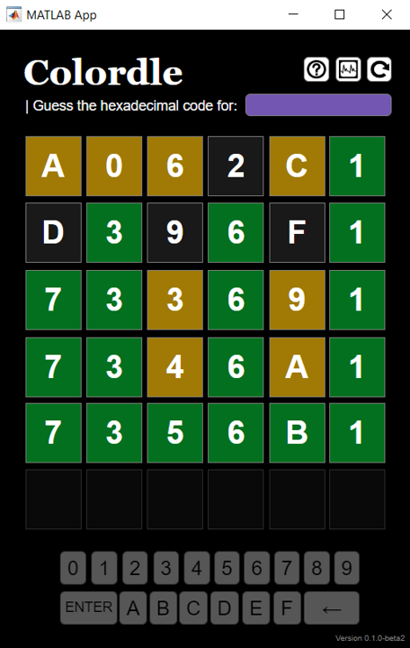

## About

[](https://www.mathworks.com/matlabcentral/fileexchange/180680) 
[](https://matlab.mathworks.com/open/fileexchange/v1?id=180680)


`Colordle` is a color guessing game inspired by the popular NY Times game Worlde. There are several other games called "Colordle" that can be found online, but this version is a little different and can be played in Matlab.

## How to play
With `Colordle` installed, type the following in the Matlab Command Window:

```matlab
colordle
```



---

The main difference between `Colordle` and Wordle is that you need to guess a 6-character hexadecimal code instead of a 5-character word. The hexadecimal alphabet only has 16 characters, but unlike Wordle, every combination of characters is possible.

Secondly, `Colordle` does not color tiles in the same way as Wordle. That is, a tile will not turn yellow if you guess a correct character in the wrong tile position. Instead, a tile will only turn yellow if your guess for that tile is within ±3 of the true character. If you guess a tile correctly, however, the tile will turn green--the same as Wordle.

For a refresher on hexadecimal codes, I recommend the explanation by [Math is Fun](https://www.mathsisfun.com/hexadecimal-decimal-colors.html).


## Useful features
* There are 255<sup>3</sup>=16,777,216 possible hexadecimal combinations. To keep the game fair, `Colordle` shows you the color that you are trying to guess.
* `Colordle` tracks your stats after every game. To view your stats, click the middle button in the top-right corner (it looks like a graph). 
   * Stats are stored in a file called `colordle_statistics.txt`, which is saved and updated automatically in the Desktop folder on your PC. 
   * For macOS and UNIX users, `colordle_statistics.txt` should theoretically save in the `HOME` environment, but as a Windows user I cannot test this. However, I am confident that it will work for UNIX operating systems because I tested the Colordle app in MATLAB Online and it worked just fine.